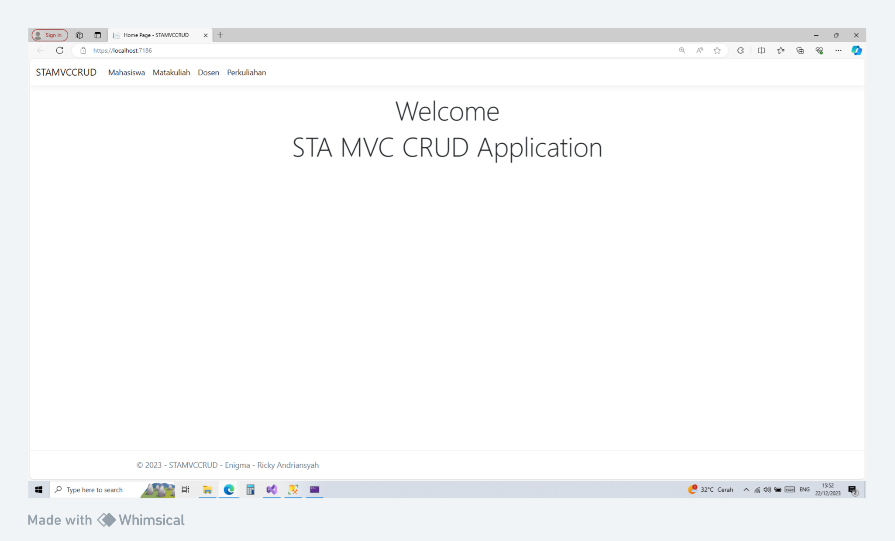
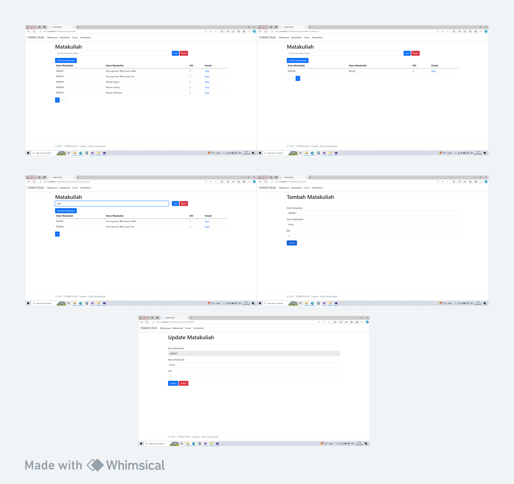
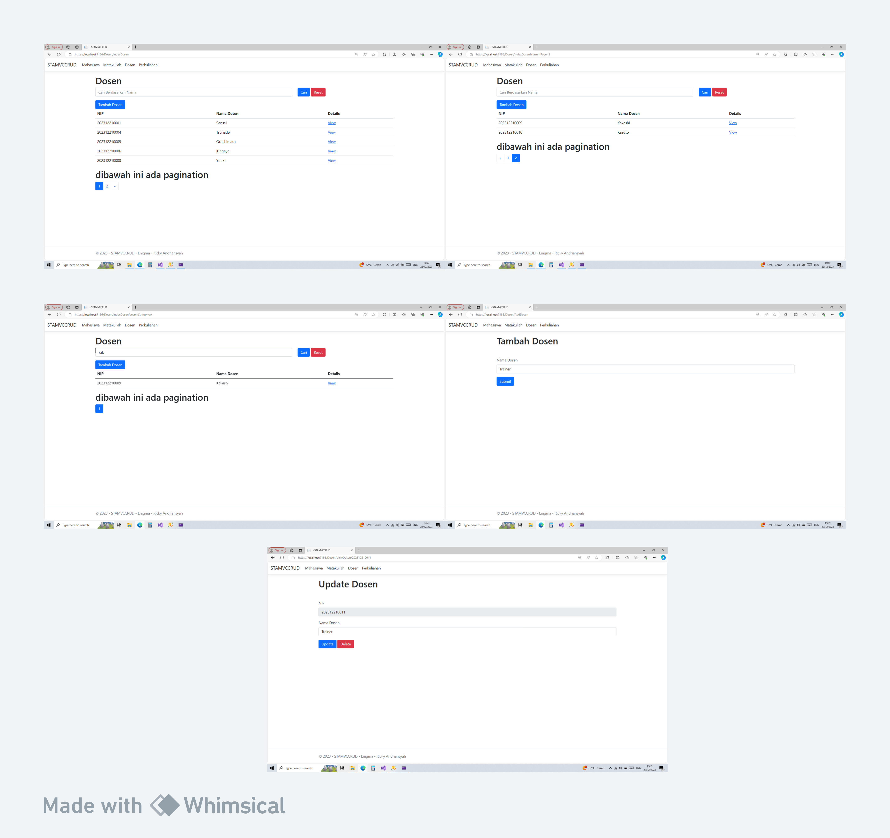
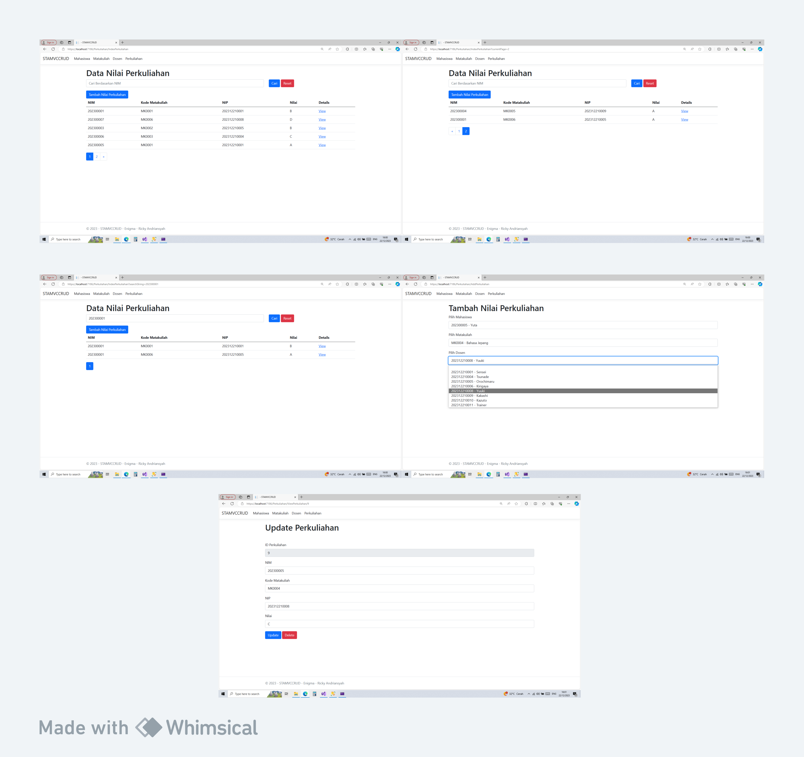
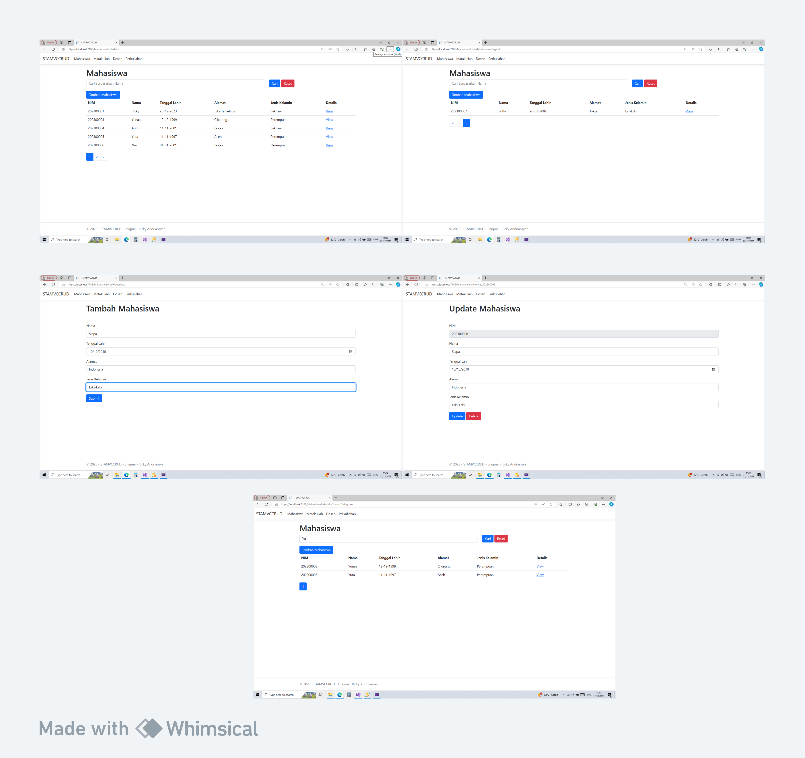

# Tes Enigmacamp PT. Sinar Tambang Arthalestari CRUD MVC menggunakan ASP.Net
oleh Ricky Andriansyah

## Deskripsi
Proyek ini adalah aplikasi berbasis web yang dikembangkan menggunakan bahasa pemrograman C# dan ASP.Net. Aplikasi ini dirancang dengan mengadopsi arsitektur Model-View-Controller (MVC).

   
## Tampilan Demo

### Tampilan Awal

### Tampilan Menu Mahasiswa

### Tampilan Menu Matakuliah

### Tampilan Menu Dosen

### Tampilan Menu Perkuliahan

